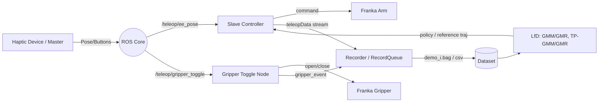

# RMIL Final Project - Teleoperation-Based Learning from Demonstration (LfD)
## Dynamic Bottle Throwing with Franka Emika Panda

---

## 📌 Overview

This project implements a **Learning from Demonstration (LfD)** framework on the **Franka Emika Panda** robot to reproduce a dynamic **bottle throwing task**. The robot grasps a bottle, aligns it, and throws it into a trash bin.

Using **Gaussian Mixture Models (GMM)** and **Gaussian Mixture Regression (GMR)**, the robot learns motion trajectories from human demonstrations and successfully reproduces a multi-phase throwing motion.

The project was developed as part of the RMIL laboratory course and serves as a foundation for further research in imitation learning and embodied intelligence.

---

## 🎯 Task Description

The robot performs a three-phase motion:

1. **Part 1 – Preparation Motion**
   - Move to bottle 
   - Grasp the bottle cap

2. **Part 2 – Transition Phase**
   - Move to pre-throw pose
   - Position refinement

3. **Part 3 – Throw Execution**
   - Fast motion and throw-velocity threshold detection
   - Additional yaw rotation (~1.5 rad/s)
   - Bottle release

The yaw rotation significantly improves the naturalness of the throw.

---
## System Overview


---

## 📂 Repository Structure

```
franka_haptic_teleoperation/
├── docker/                 # Docker environment configuration, Dockerfile
├── sdk-3.1/                # Franka SDK, different versions
├── franka_teleop_lmt/      # Main ROS package
│   ├── config/             # Controller and parameter configurations
│   ├── include/            # Header files
│   ├── launch/             # ROS launch files
│   ├── LfD/                # Learning from Demonstration Matlab codes
│   ├── models/             # Trained GMM models / parameters(Sim)
│   ├── msg/                # Custom ROS messages
│   ├── scripts/            # Python helper scripts
│   ├── src/                # Main C++ source files
│   ├── TeleopData/         # Recorded/learned demonstration data (CSV)
│   ├── world/              # Simulation world files (if used)
│   ├── package.xml         # ROS package definition
│   ├── CMakeLists.txt      # Build configuration
│   └── Makefile            # Build helper
└── README.md
```
---

# 🕹 Teleoperation Framework

The haptic device provides:

- Cartesian translation control
- Gripper toggle
- Yaw / Pitch rotation
- Workspace scaling
- Force feedback

### Special Button Logic

When the freeze button is pressed:
- Linear velocity = 0
- Rotation mode activated

This enables precise alignment before throwing.

---

# 📊 Demonstration Data Structure

Each recorded CSV file contains:

- End-effector position (Xf_x, Xf_y, Xf_z)
- End-effector velocity (Vf_x, Vf_y, Vf_z)
- Force feedback (Fc_x, Fc_y, Fc_z)
- Gripper event
- Yaw rate command
- Pitch rate command
- Timestamp

This extended structure enables robust segmentation and modeling.

---

# 🔀 Task Segmentation

The task is divided into 3 segments:

1. **Segment 1** – Approach & Grasp
2. **Segment 2** – Lift & Pre-Throw Alignment
3. **Segment 3** – Throw & Release

### Segmentation Strategy

- Event-based (gripper open/close)
- Velocity threshold (detect throwing phase)

```mermaid
flowchart LR
  S[Raw teleopData] --> F1[Find event markers: gripper_close/open]
  S --> F2[Find kinematic cues: speed peaks / acceleration]
  F1 --> SEG[Segmentation]
  F2 --> SEG
  SEG --> P1[Phase 1: Approach & Grasp]
  SEG --> P2[Phase 2: Lift & Move to Pre-throw Pose]
  SEG --> P4[Phase 3: Throw & Release]
  ```
Segmentation improves stability and modeling accuracy.

---

# 📈 Learning Strategy

## Segment 1 & 2: Position-Conditioned GMM/GMR

We model the joint distribution:

P(x, v)

During reproduction:

v_t = E[v | x_t]

Then integrate:

x_{t+1} = x_t + v_t*Δt

This creates a smooth velocity field representation of motion.

---

## Segment 3: Velocity Primitive

Throwing is highly dynamic.

Instead of conditioning on position, we model:

P(v)

Reproduction:

v_{t+1} = Σ h_k*μ_k

This produces a stable velocity primitive suitable for explosive motion.

---

# 🔧 Segment Integration

In the LfD_combi node:

- Each segment is executed sequentially
- Independent parameter tuning per segment
- Throwing phase includes:
  - Pitch rate control
  - Release timing control
  - Vertical velocity scaling

---

# 🚀 Final Result

The robot autonomously performs:

✔ Grasp  
✔ Lift  
✔ Align  
✔ Dynamic Throw  
✔ Timed Release  

**The bottle successfully lands inside the trash bin.**

---

# 📌 Key Contributions

- Designed a segmented LfD framework
- Implemented hybrid probabilistic motion modeling
- Developed velocity primitive for dynamic motion
- Integrated discrete and continuous control
- Achieved autonomous dynamic manipulation

---

## 🛠 System Architecture

- **Robot**: Franka Emika Panda
- **Haptic Device** (teleoperation master): Novint Falcon Haptic Device
- **Controller**: `cartesian_impedance_example_controller`
- **Middleware**: ROS1 (Noetic)
- **Language**: C++
- **MATLAB** (GMM/GMR training)
- **Trajectory Representation**: Nx3/3xN Cartesian velocity/position

### ROS Topics

- Publishes:
  - `/teleop/gripper_toggle`
  - `/cartesian_impedance_example_controller/LFcommand`
  - `/cartesian_impedance_example_controller/yaw_rate_cmd`
  - `/cartesian_impedance_example_controller/pitch_rate_cmd`

- Subscription:
  - `/cartesian_impedance_example_controller/FLfeedback`
---

## ⚙️ Key Implementation Details

- Adjusted Number of datapoints (per demo) using `nbD`
- Resolved reference-frame mismatch issues
- Ensured velocity commands were correctly scaled
- Added and tunded yaw / pitch rotation during Part3
- Tuned z-axis velocity of each Part for accuracy of pose
- Tuned release timing for stable throw

---

# 🚀 How to Run haptic device teleoperation
## Leader Side
### Run docker container on leader PC
```bash
docker run -it --rm   \
--name franka_haptic   \
--net=host   \
--privileged   \
-e DISPLAY=$DISPLAY   \
-v /tmp/.X11-unix:/tmp/.X11-unix   \
-v /dev/bus/usb:/dev/bus/usb   \
-v ~/franka_haptic_teleoperation:/ws/src/franka_haptic_teleoperation   \
-w /ws   \
franka-noetic-fci5.9:teleop_latest   bash
```

### Build enviroment on leader PC
```bash
catkin_make
source devel/setup.bash
export ROS_MASTER_URI=http://ip:11311
export ROS_IP=self_ip
```

### Run leader node 
```bash
roslaunch franka_teleop_lmt leader_master.launch
```
---
## Follower Side
### Build enviroment on follower PC (connected with franka arm)
```bash
catkin_make
source devel/setup.bash
export ROS_MASTER_URI=http://ip:11311
export ROS_IP=self_ip
```

### Test communication between follower PC and franka arm
```bash
./test_communication robot_ip
```

### Start Controller
```bash
roslaunch franka_teleop_lmt robot_teleop_slave.launch robot_ip:=xxx
```

---
# 🚀 How to Run LfD
### Test communication between follower PC and franka arm
```bash
./test_communication robot_ip
```

### Start Controller
```bash
roslaunch franka_teleop_lmt robot_teleop_slave.launch robot_ip:=xxx
```
### Run LfD Node

```bash
roslaunch franka_teleop_lmt LfD_node.launch
```


# 🔮 Future Work

- Online segmentation
- Learned release timing
- Physics-aware throwing optimization
- Vision-based target detection
- Generalization to varying task setups

---

# 📷 Demo


---

# 👤 Author

- Name: Wenhao Zhao 
- E-mail: wenhao.zhao@tum.de
- University: Technical University of Munich 

---